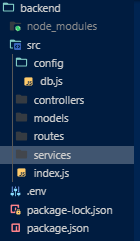
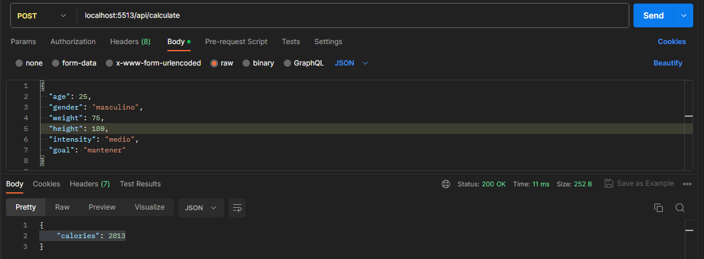

-----------------------FITHUB-----------------------------

--                BACKEND                --

Se instalaron los paquetes y dependencias necesarias dentro de la carpeta /backend.

Se creó una estructura de carpetas para organizar nuestro proyecto, incluyendo las carpetas para los modelos, controladores, rutas y archivos principales.
(Muestra visual de la estructura):

|-->Seccion de calorias<--|

-Se creó el modelo de datos para los usuarios, que nos permitirá almacenar la información necesaria para calcular las calorías requeridas por cada usuario. En este caso, el modelo contiene campos para la edad, género, peso, altura, meta u objetivo e intensidad del entrenamiento.

-Se configuró la conexión con la base de datos MongoDB usando Mongoose. Definiendo una cadena de conexión y se empleó mongoose.connect para conectarnos a la base de datos.

-Implementamos el controlador caloriesController.js, que contiene la lógica para calcular las calorías diarias requeridas por el usuario, basándose en su género, edad, peso, altura, objetivo o meta a alcanzar e intensidad de entrenamiento. Luego, respondemos con el resultado de las calorías calculadas.

-Creamos una ruta en el archivo calories.js que permite a los usuarios enviar sus datos para calcular las calorías. Utilizamos el método router.post para procesar la solicitud y enviarla al controlador correspondiente.

--El programa fue testeado con el siguiente ejemplo para verificar su funcionamiento:
        en postman seleccionamos el metodo POST y escribimos :

             localhost:5513/api/calculate

        dentro del body ponemos el siguiente objeto json:
       {
        "age": 25,
        "gender": "masculino",
        "weight": 75,
        "height": 180,
        "intensity": "medio",
        "goal": "mantener"
        }

        el resultado recibido:
            {
                "calories": 2813
            }
    En postman (El recurso usado para probar la calculadora) se veria algo asi:
